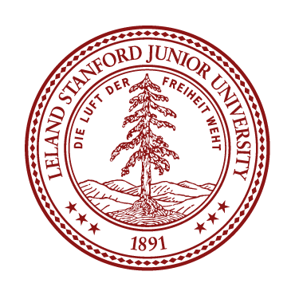

  
  <h3 align="center">Code in Place 2025 and Karel Solutions</h3>  
  

  

# About Code in Place

Stanford University's "Code in Place" program is an international computer science Python course offered for free across the world. In the 2025 version of the course, the program had 650 volunteer teachers and 9,500 students.

Code in Place is the online version of Stanford's CS106A course ("Programming Methodology"), the university's largest and most popular programming course with enrollment of 1,300+ students per year.